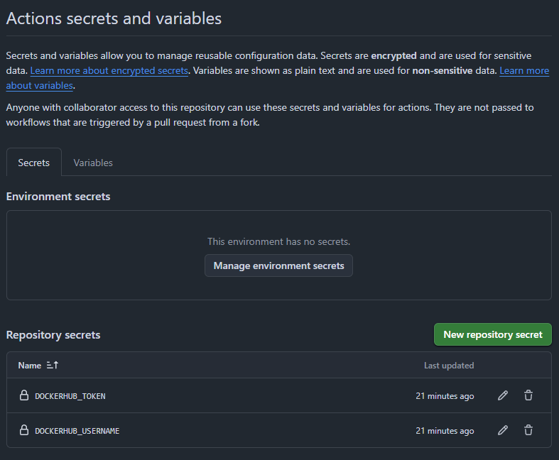
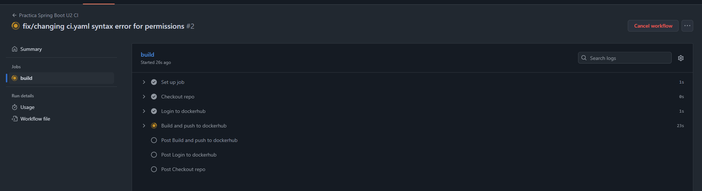
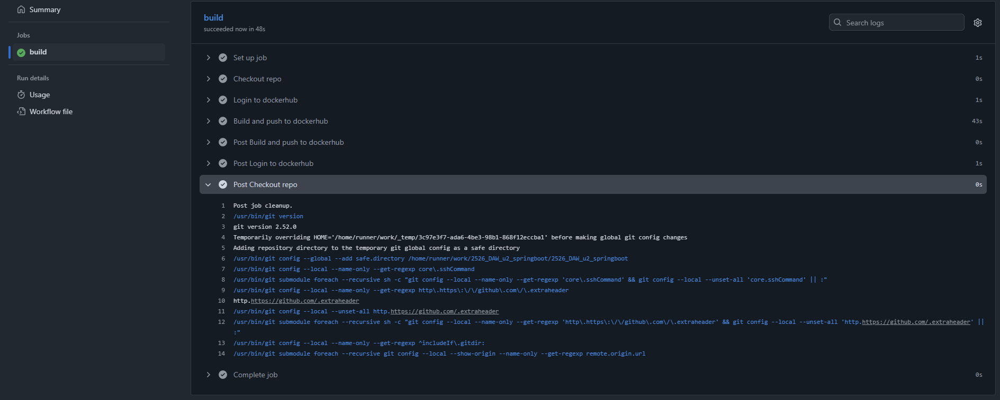
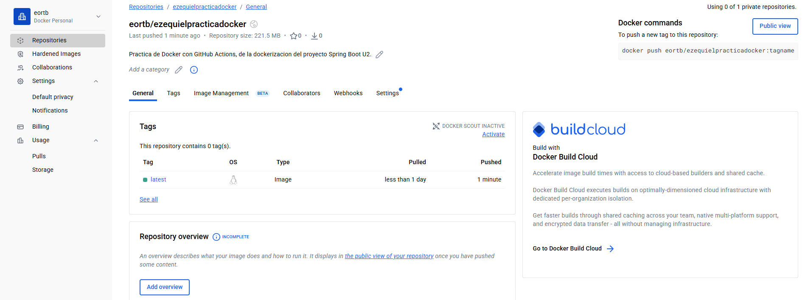
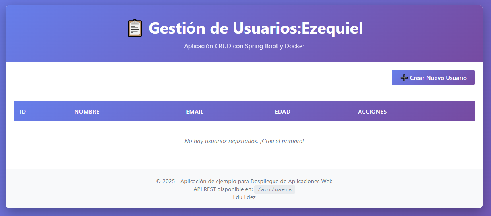

# DOCUMENTACIÓN DESPLIEGUE DE LA PRACTICA DE SPRING BOOT CON CI/CD HACIA DOCKER HUB

## 1. Configuración secrets de Docker Hub con repositorio de GitHub
Primero he ido a docker hub y he creado mi dockerhub access token, para después configurarlo correctamente en los secrets de mi repositorio de GitHub. Los secrets que configuré en mi repositorio de GitHub son los siguientes:
- DOCKERHUB_TOKEN = aqui_mi_dockerhub_access_token
- DOCKERHUB_USERNAME = aqui_mi_usuario_de_dockerhub (eortb)



---

## 2. GitHub Actions Workflow
- A continuación cree mi script de automatización con (.github/workflows/ci.yaml). A continuación lo adjunto con un github permanent link para posteriormente comentarlo.

https://github.com/obezeq/2526_DAW_u2_springboot/blob/64a4dc558a331d7921d077f412d6d88359ca55fc/.github/workflows/ci.yaml#L1-L6
- Aquí definimos el nombre del workflow, y a la vez definimos cual va a ser el punto donde se va a ejecutar el action, que en este caso es cuando se hace push en la rama `master`

https://github.com/obezeq/2526_DAW_u2_springboot/blob/c7b698bf7159eb9c9c47cf790fdc9a9f124eb0e2/.github/workflows/ci.yaml#L8-L10
- Cuando se ejecuta lo definido anteriormente en el `on`, se realiza el job se hace un build que corre en Ubuntu Latest.

https://github.com/obezeq/2526_DAW_u2_springboot/blob/c7b698bf7159eb9c9c47cf790fdc9a9f124eb0e2/.github/workflows/ci.yaml#L12-L27
- El cual realiza los siguientes steps:
    - Hace un checkout del repositorio en la rama master como definimos anteriormente.
    - Luego hace un login en Docker Hub con los secrets que hemos definido anteriormente.
    - Para posteriormente hacer un push y definimos el tag que queremos que tenga el nombre de la imagen.

---

## 3. Cambio del título de la página HTML
https://github.com/obezeq/2526_DAW_u2_springboot/blob/409442f19fc366685ed27e604b778ac4f58171d8/src/main/resources/templates/index.html#L1-L14
- Cambié mi nombre de la página, para eso me fui al `src/main/resources/templates/index.html` y cambié mi título a
https://github.com/obezeq/2526_DAW_u2_springboot/blob/409442f19fc366685ed27e604b778ac4f58171d8/src/main/resources/templates/index.html#L12

---

## 4. Proceso de GitHub Actions > Docker Hub Built & Deploy
Podemos ver como cuando hice un commit podemos ver en el github actions como se está haciendo un build, observando que esta haciendo el building del github actions en estado pendiente
    - 

Una vez ha terminado de hacer el build del GitHub Action, podemos ver que ha terminado con éxito
    - 

Como ha sido satisfactorio, revismamos el Docker Hub y vemos que se ha automatizado correctamente el CI/CD hacia el Docker Hub, gracias a lo que hemos configurado en el archivo .yaml
    - 

---

## 5. ¿Cómo ejecutar la imagen que he subido a Docker Hub?

### SCRIPT BASH AUTOMÁTICO

### PASOS PARA EJECUTARLO

1. Primero descargué la imagen con el siguiente comando:
```bash
docker pull eortb/ezequielpracticadocker:latest
```

2. A continuación lancé la imagen con el siguiente comando y hice un map con el puerto del contenedor 8080, con el de mi maquina 80, para poder ver la web en mi localhost de mi máquina.
```bash
docker run --name practicadocker -p 80:8080 -d eortb/ezequielpracticadocker:latest
```

3. Visualizo que se despliega correctamente mi imagen de dockerhub en mi localhost
- 

4. Script Bash para automatizar deploy
- En vez de ejecutar los comandos manualmente, se pueda automatizar el deploy con el siguiente script bash:
    - [automation.sh](/automation.sh)

```bash
chmod +x automation.sh
./automation.sh
```

---

- Curso: 2º DAW
- Fecha: 04/12/2025
- Nombre: Ezequiel